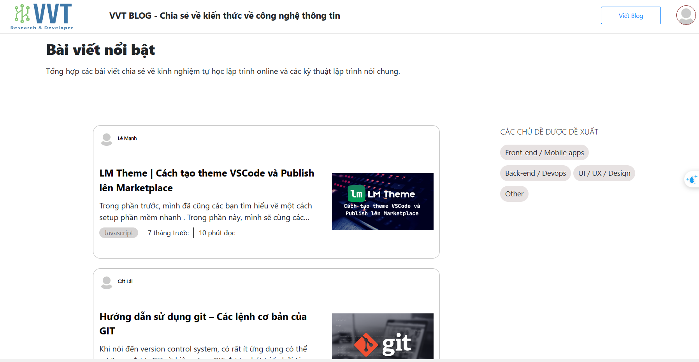
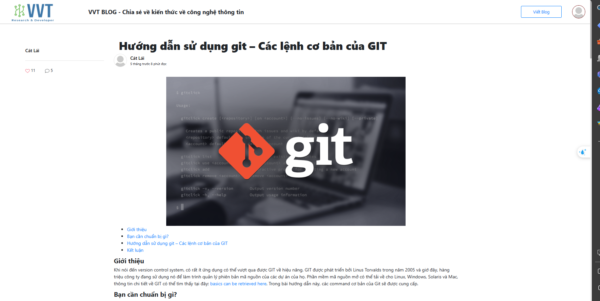
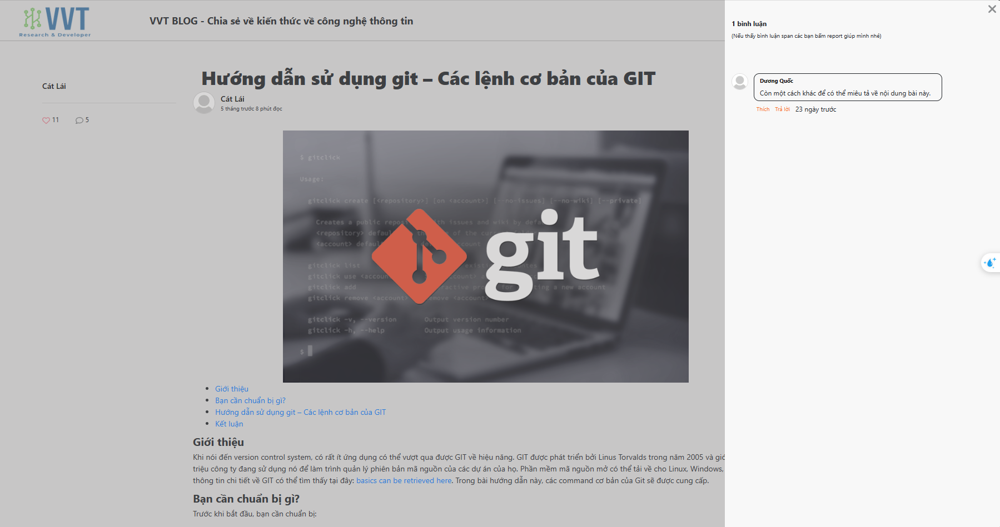
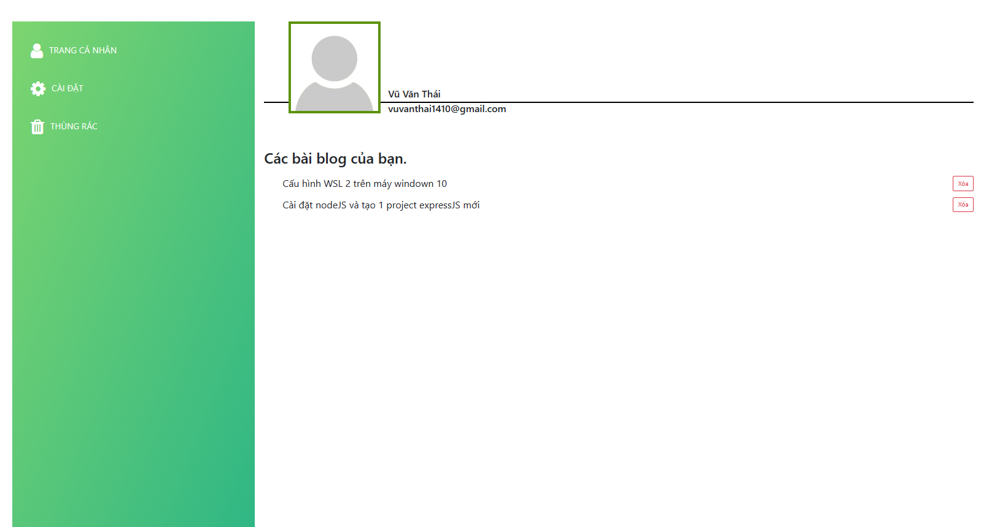
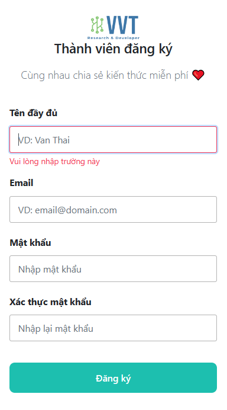
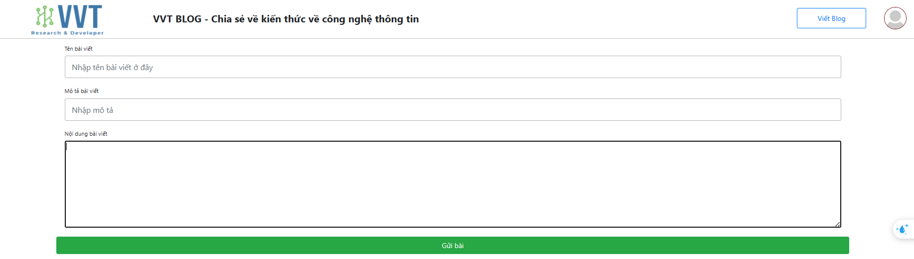

# Blog | Đồ án cá nhân

**Chủ đề:** Website chia sẻ, trao đổi các kiến thức về công nghệ

**Công nghệ sử dụng**

- Framework: NodeJS / ExpressJS
- DB: MongoDB

**Giới thiệu về từng phần của website**

- Đọc tương tác với các bài viết(bình luận, thả cảm xúc, ...)
- Tạo, Xóa, bài viết
- Đăng nhập, đăng kí
- Tìm kiếm bài viết

**Một vài hình ảnh nổi bật của website**

